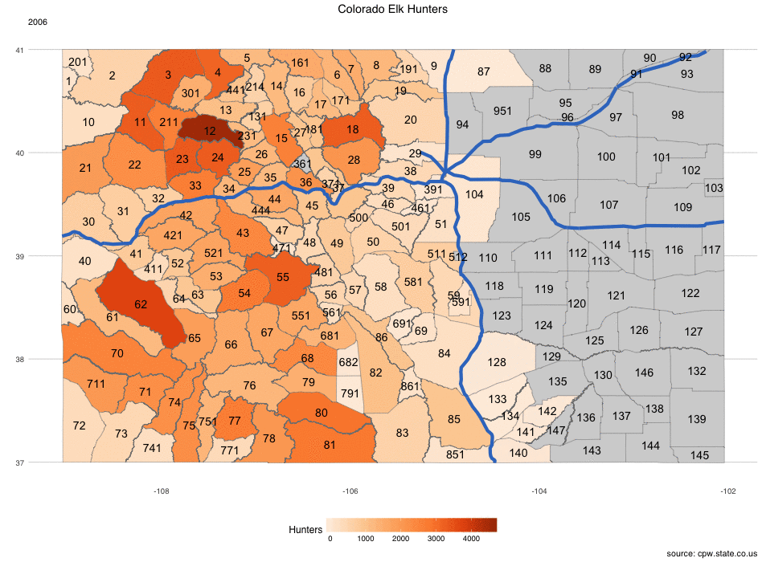

***
## Description
Use historical draw results, and number of hunters to train a model we can use to 
predict the number of hunters in future years. I would like to compare this to the results
we generated by grouping the seasons together. 


*__NOTICE__ that I am only looking at the general rifle hunting seasons on public land. There are also 
hunters for Archery, Muzzleloader, Private Land, Ranching for Wildlife, etc.*

***
## Setup
Load required libraries for wrangling data, charting, and mapping
```{r}
library(plyr,quietly = T) # data wrangling
library(dplyr,quietly = T) # data wrangling
library(ggplot2, quietly = T) # charting
library(ggthemes,quietly = T) # so I can add the highcharts theme and palette
library(scales,quietly = T) # to load the percent function when labeling plots
library(caret,quietly = T) # classification and regression training
library(foreach,quietly = T) # parallel processing to speed up the model training
library(doMC,quietly = T) # parallel processing to speed up the model training
library(lubridate,quietly = T) # for timing models
```

Set our preferred charting theme
```{r}
theme_set(theme_minimal()+theme_hc()+theme(legend.key.width = unit(1.5, "cm")))
``` 

Run script to get hunter data
```{r}
source('~/_code/colorado-dow/datasets/Colorado Elk Harvest Data.R', echo=F)
```

Table of the harvest data
```{r}
head(COElkRifleAll)
```


Run script to get draw data
```{r}
source('~/_code/colorado-dow/datasets/Elk Drawing Summaries.R', echo=F)
```

Table of the data
```{r}
head(COElkDrawAll)
```

source geodata
```{r}
source('~/_code/colorado-dow/datasets/Colorado GMUnit and Road data.R', echo=F)
```

Take a peak at the boundary data
```{r}
head(Unitboundaries2)
```

Set to predictive analytics directory
```{r}
setwd("~/_code/colorado-dow/phase III - predictive analytics")
```

### Organize data
Will start by grouping all of the seasons together, and modeling the number of hunters per Year and Unit

Group Draw results data by Year and Unit
```{r}
COElkDraw_Unit <- summarise(group_by(COElkDrawAll,Year,Unit,Season),
                       Quota = sum(Orig_Quota,na.rm = T),
                       Drawn = sum(Chcs_Drawn,na.rm = T))
```

Appropriate field classes for model training
```{r}
COElkDraw_Unit$Year <- as.numeric(COElkDraw_Unit$Year)
```

Group Hunter data by Year and Unit
```{r}
COElkHunters_Unit <- summarise(group_by(COElkRifleAll,Year,Unit,Season),
                          Hunters = sum(c(Hunters.Antlered,Hunters.Antlerless,Hunters.Either),na.rm = T))

COElkHunters_Unit$Year <- as.numeric(COElkHunters_Unit$Year)
```

Join in Hunter and Draw data together
```{r}
COElkHunters_Unit <- left_join(COElkHunters_Unit, COElkDraw_Unit, by = c("Year","Unit","Season"))
```

Replace the draw data that don't have entries with 0
```{r}
COElkHunters_Unit$Drawn[is.na(COElkHunters_Unit$Drawn)] <- 0
COElkHunters_Unit$Quota[is.na(COElkHunters_Unit$Quota)] <- 0
```

Split into train and test sets. Will use 75% of the data to train on. 

```{r}
COElkHunters_Unit <- mutate(group_by(COElkHunters_Unit,Unit),
                       numentries = n())
COElkHunters_Unit <- filter(COElkHunters_Unit, numentries >= 3)
COElkHunters_Unit$UnitYearSeason <- paste(COElkHunters_Unit$Unit, COElkHunters_Unit$Year,COElkHunters_Unit$Season)

traindata2 <- COElkHunters_Unit %>% group_by(Unit) %>% sample_frac(size = .75, replace = F)
testdata2 <- COElkHunters_Unit[!COElkHunters_Unit$UnitYearSeason %in% traindata2$UnitYearSeason,]

COElkHunters_Unit <- select(COElkHunters_Unit, -UnitYearSeason, -numentries)

traindata2 <- select(traindata2, -UnitYearSeason, -numentries)
testdata2 <- select(testdata2, -UnitYearSeason, -numentries)
```

Save off for importing into AzureML
```{r}
write.csv(COElkHunters_Unit,file = "~/_code/colorado-dow/datasets/COElkHunters_Unit.csv",row.names = F)
```
### Data Visualization
notice that the number of hunters data is skewed.
```{r fig.width=10}
ggplot(COElkHunters_Unit, aes(Hunters)) + 
  geom_density() +
  xlab("Hunters in Unit") +
  ylab("Number of Units") +
  theme(axis.text.y = element_blank()) +
  labs(title="Distribution of Hunters in each Unit", subtitle="2006-2017", caption="source: cpw.state.co.us")

```


A general rule of thumb to consider is that skewed data whose ratio of the highest value to the 
lowest value is greater than 20 have significant skewness. Also, the skewness statistic can be 
used as a diagnostic. If the predictor distribution is roughly symmetric, the skewness values 
will be close to zero. As the distribution becomes more right skewed, the skewness statistic 
becomes larger. Similarly, as the distribution becomes more left skewed, the value becomes negative.
Replacing the data with the log, square root, or inverse may help to remove the skew.

Example of how BoxCox can redistribute the data
```{r}
preProcValues2 <- preProcess(as.data.frame(traindata2), method = "BoxCox")
trainBC <- predict(preProcValues2, as.data.frame(traindata2))
```

```{r fig.width=10}
ggplot(trainBC, aes(Hunters)) + 
  geom_density() +
  xlab("BoxCox Hunters in Unit") +
  ylab("Number of Units") +
  theme(axis.text.y = element_blank()) +
  labs(title="BoxCox Distribution of Hunters in each Unit", subtitle="2006-2017", caption="source: cpw.state.co.us")
```
caret has a preproccess function for correcting for skewness 'BoxCox', we will need to be sure to
look at using this function in the training models.

***
## Model Building

### Model Training Methods
Loop through possible methods, utilizing the quicker 'adaptive_cv' parameter search from caret.
Consider scripting this into AzureML to make it run much faster, though there is more setup and errors to 
control for

```{r}
quickmethods <- c("lm",'svmLinear',"svmRadial","knn","cubist","kknn","glm.nb")

step1_all_Unit <- NULL
for (imethod in quickmethods) {
  step1_Unit <- NULL
  start <- now()
  
  # if (imethod == "lm") {
  #   controlmethod <- "repeatedcv"
  # } else {controlmethod <- "adaptive_cv"}
  controlmethod <- "repeatedcv"
  fitControl <- trainControl(
    method = controlmethod,
    # search = 'random',
    number = 4,
    repeats = 4,
    allowParallel = TRUE,
    summaryFunction = defaultSummary)
  
  registerDoSEQ()
  registerDoMC(cores = 6)
  
  HuntersModel_1_Unit = train(Hunters ~ ., data = traindata2,
                         method = imethod,
                         tuneLength = 15,
                         trControl = fitControl)
  
  HuntersModel_1_Unit
  
  # measure performance
  predictdata <- predict(HuntersModel_1_Unit, testdata2)
  
  step1_Unit$method <- imethod
  step1_Unit$RMSE <- postResample(pred = predictdata, obs = testdata2$Hunters)[1]
  step1_Unit$duration <- now() - start
  step1_Unit <- as.data.frame(step1_Unit)
  step1_all_Unit <- rbind(step1_all_Unit,step1_Unit)
}
```
View Results, and compare to previous first models that did not expand to Seasons
```{r}
step1_all
step1_all_Unit
```
The performance RMSE metric is certainly improved when including the Seasonal grouping.
Lets take the best method, and see if it is visually reasonable while also charting without Seasons.

### Predictions using best Season model
Build model
```{r}
controlmethod <- "repeatedcv"
  fitControl <- trainControl(
    method = controlmethod,
    # search = 'random',
    number = 4,
    repeats = 4,
    allowParallel = TRUE,
    summaryFunction = defaultSummary)
  
registerDoSEQ()
registerDoMC(cores = 6)
  
HuntersModel_1_Unit = train(Hunters ~ ., data = COElkHunters_Unit,
                         method = "kknn",
                         # preProc = c("center","scale"), 
                         tuneLength = 15,
                         trControl = fitControl)
  
HuntersModel_1_Unit
```
Predict Hunter for next year, 2018
```{r}
# Get list of Units and Seasons that will have data
COElkHunters2018_Unit <- COElkHunters_Unit
COElkHunters2018_Unit$Unit_Season <- paste(COElkHunters2018_Unit$Unit,COElkHunters2018_Unit$Season)
COElkHunters2018_Unit <- as.data.frame(unique(COElkHunters2018_Unit$Unit_Season))
colnames(COElkHunters2018_Unit) <- "Unit_Season"
# Fill in missing Units and Seasons per unique Unit_Seasons
COElkHunters2018_Unit$Unit <- str_extract(COElkHunters2018_Unit$Unit_Season,"[:alnum:]+(?=[:blank:])")
COElkHunters2018_Unit$Season <- str_extract(COElkHunters2018_Unit$Unit_Season,"(?<=[:blank:])[:alnum:]+")
COElkHunters2018_Unit <- select(COElkHunters2018_Unit, -Unit_Season)
COElkHunters2018_Unit$Year <- 2018
# Draw data for 2018
COElkDraw_Unit2018 <- filter(COElkDraw_Unit,Year==2018)

# A left join will autofill missing draw data with NAs, but will retain the full list of Unit Seasons
COElkHunters2018_Unit <- left_join(COElkHunters2018_Unit,COElkDraw_Unit2018)

# Replace the draw data that don't have entries with 0
COElkHunters2018_Unit$Drawn[is.na(COElkHunters2018_Unit$Drawn)] <- 0
COElkHunters2018_Unit$Quota[is.na(COElkHunters2018_Unit$Quota)] <- 0

# Only use the fields that were included in the model
COElkHunters2018_Unit <- COElkHunters2018_Unit[, colnames(COElkHunters2018_Unit) %in% c("Unit","Season",HuntersModel_1_Unit$coefnames)]
# Use trained model to predict Hunters
COElkHunters2018_Unit$Hunters <- round(predict(HuntersModel_1_Unit, COElkHunters2018_Unit))

COElkHunters2018_Unit$Hunters[COElkHunters2018_Unit$Hunters<0] <- 0
```

Label and Join models together for comparisons
```{r}
# Load first model without Seasons
load("~/_code/colorado-dow/datasets/COElkHunters2018.RData")
Hunterscompare <- rbind.fill(COElkHunters,COElkHunters2018)
Hunterscompare$modeldata <- "Without Seasons"

Hunterscompare_Season <- rbind.fill(COElkHunters_Unit,COElkHunters2018_Unit)
Hunterscompare_Season <- summarise(group_by(Hunterscompare_Season,Year,Unit),
                                   Hunters = sum(Hunters))
Hunterscompare_Season$modeldata <- "Seasons"

Hunterscompare <- rbind.fill(Hunterscompare,Hunterscompare_Season)

```
```{r}
# Group Units
HunterscompareStatewide <- summarise(group_by(Hunterscompare,Year,modeldata),
                                   Hunters = sum(Hunters))
```

```{r fig.width=10}
ggplot(HunterscompareStatewide, aes(Year,Hunters,group=modeldata,fill=modeldata)) +
  geom_bar(position="dodge",stat="identity") +
  coord_cartesian(ylim = c(130000,155000)) +
  scale_fill_hc() +
  labs(title="Statewide Elk Hunters", caption="source: cpw.state.co.us")
```


#### Hunters Statewide by Season and Year
```{r fig.width=10}
Hunters_Season <- rbind.fill(COElkHunters_Unit,COElkHunters2018_Unit)
ggplot(Hunters_Season, aes(Year,Hunters,group=Season,fill=Season)) +
  geom_bar(position="dodge",stat="identity") +
  # coord_cartesian(ylim = c(130000,155000)) +
  scale_fill_hc() +
  labs(title="Statewide Elk Hunters", caption="source: cpw.state.co.us")
```

#### Hunters .... other charts?


## Keep going by creating models for hunters per year, unit and season?


```{r}
top_two_models <- top_n(step1_all,2,-RMSE)$method
```
### More Model Training Methods

Take the top two and determine some additonal methods to try by maximizing the Jaccard
dissimilarity between sets of models
```{r}
tag <- read.csv("tag_data.csv", row.names = 1)
tag <- as.matrix(tag)
```

Select only models for regression
```{r}
regModels <- tag[tag[,"Regression"] == 1,]

all <- 1:nrow(regModels)
dissimilarmethods_all <- NULL
for (itoptwo in 1:2) {
  ## Seed the analysis with the model of interest
  start <- grep(top_two_models[itoptwo], rownames(regModels), fixed = TRUE)
  pool <- all[all != start]
  
  ## Select 4 model models by maximizing the Jaccard
  ## dissimilarity between sets of models
  nextMods <- maxDissim(regModels[start,,drop = FALSE], 
                        regModels[pool, ], 
                        method = "Jaccard",
                        n = 4)
  
  rownames(regModels)[c(nextMods)]
  
  dissimilarmethods <- rownames(regModels)[nextMods]
  dissimilarmethods <- str_extract(string = dissimilarmethods,pattern = "[:alnum:]+(?=\\))")
  dissimilarmethods_all <- c(dissimilarmethods_all,dissimilarmethods)
}
```

Now we have 8 more methods to try in the same manner
```{r}
dissimilarmethods_all <- unique(dissimilarmethods_all)
dissimilarmethods_all
```
```{r}
for (imethod in dissimilarmethods_all) {
  step1 <- NULL
  start_timer <- now()[1]
  
  if (imethod == "lm") {
    controlmethod <- "repeatedcv"
  } else {controlmethod <- "adaptive_cv"}
  
  fitControl <- trainControl(
    method = controlmethod,
    # search = 'random',
    number = 4,
    repeats = 4,
    allowParallel = TRUE,
    summaryFunction = defaultSummary)
  
  registerDoSEQ()
  registerDoMC(cores = 6)
  
  HuntersModel_1 = train(Hunters ~ ., data = traindata,
                         method = imethod,
                         preProc = c("center","scale"), 
                         tuneLength = 15,
                         trControl = fitControl)
  
  HuntersModel_1
  
  # measure performance
  predictdata <- predict(HuntersModel_1, testdata)
  
  step1$method <- imethod
  step1$RMSE <- postResample(pred = predictdata, obs = testdata$Hunters)[1]
  step1$duration <- now()[1] - start_timer[1]
  step1 <- as.data.frame(step1)
  step1_all <- rbind(step1_all,step1)
}
```

```{r}
step1_all
```

### Preprocessing on Top Modeling Methods
Now lets work on some refined tuning on the top methods
Any valuable preprocessing steps?
```{r}
preprocessfunctions <- c("BoxCox", "YeoJohnson", "expoTrans", "center", "scale", "range", "knnImpute", "bagImpute", "medianImpute", "pca", "ica", "spatialSign", "corr", "zv", "nzv")
topmethods <- top_n(step1_all,2,-RMSE)$method

fitControl <- trainControl(
  method = "adaptive_cv", #repeatedcv, 
  search = 'random',
  number = 10, #4
  repeats = 10, #10
  # classProbs = TRUE,
  # savePred = TRUE,
  allowParallel = TRUE,
  summaryFunction = defaultSummary)

PPperformance_all <- NULL
PPperformance <- NULL
for (imethod in topmethods) {
  for (ipreprocess in preprocessfunctions) {
    registerDoSEQ()
    registerDoMC(cores = 6)
    
    PreProcessModel = train(Hunters ~ ., data = traindata,
                         method = imethod,
                         preProc = ipreprocess, 
                         #tuneLength = 10,
                         #tuneGrid = kknnTuneGrid,
                         trControl = fitControl)
    
    print(PreProcessModel)
    
    # check performance
    predictdata <- predict(PreProcessModel, testdata)
    
    PPperformance$method <- imethod
    PPperformance$preprocess <- ipreprocess
    PPperformance$RMSE <- postResample(pred = predictdata, obs = testdata$Hunters)[1]
    PPperformance <- as.data.frame(PPperformance)
    PPperformance_all <- rbind(PPperformance_all,PPperformance)
  }
}
# Some of the models were loaded into AzureML and processed there.
# Output from AzureML
# [ModuleOutput]          method preprocess     RMSE
# [ModuleOutput] RMSE       kknn     BoxCox 130.7939
# [ModuleOutput] RMSE1      kknn YeoJohnson 130.9600
# [ModuleOutput] RMSE2      kknn     center 130.7331
# [ModuleOutput] RMSE3      kknn      scale 130.1818
# [ModuleOutput] RMSE4      kknn        pca 130.2071
# [ModuleOutput] RMSE5 svmRadial     BoxCox 154.0898
# [ModuleOutput] RMSE6 svmRadial YeoJohnson 169.9816
# [ModuleOutput] RMSE7 svmRadial     center 154.1891
# [ModuleOutput] RMSE8 svmRadial      scale 154.1000
# [ModuleOutput] RMSE9 svmRadial        pca 164.0881
# svmRadial and kknn don't perform better with any of the preprocessing functions in place
```
```{r}
PPperformance_all
```

### Model Predictors
Now we can review the predictors, there are only a few fields so I will manually test performance
while excluding each of them to monitor their importance.
Some of our fields are instinctively required (Year, Unit)
```{r}
Predictors <- c("Quota","Drawn")
Predictorperformance_all <- NULL
Predictorperformance <- NULL
for (imethod in topmethods) {
  for (ipredictor in Predictors) {
    registerDoSEQ()
    registerDoMC(cores = 6)
    
    PredictorModel = train(Hunters ~ ., data = select(traindata,-ipredictor),
                            method = imethod,
                            tuneLength = 15,
                            trControl = fitControl)
    
    print(PredictorModel)
    
    # check performance
    predictdata <- predict(PredictorModel, testdata)
    
    Predictorperformance$method <- imethod
    Predictorperformance$missing_predictor <- ipredictor
    Predictorperformance$RMSE <- postResample(pred = predictdata, obs = testdata$Hunters)[1]
    Predictorperformance <- as.data.frame(Predictorperformance)
    Predictorperformance_all <- rbind(Predictorperformance_all,Predictorperformance)
  }
}
```

```{r}
Predictorperformance_all
```


svMRadial will perform better with all of the predictors, while kknn performs
better with only Unit and Year fields

Use above information to test out various combinations of preprocessing and predictor sets

##### kknn
kknn without Quota and Drawn
```{r}
fitControl <- trainControl(
  method = "adaptive_cv", #repeatedcv, 
  search = 'random',
  number = 10, #4
  repeats = 10, #10
  # classProbs = TRUE,
  # savePred = TRUE,
  allowParallel = TRUE,
  summaryFunction = defaultSummary)

registerDoSEQ()
registerDoMC(cores = 6)

kknnModel = train(Hunters ~ ., data = select(COElkHunters,-Quota, -Drawn),
                  method = "kknn",
                  tuneLength = 75,
                  trControl = fitControl)

```
```{r}
kknnModel
```

Best RMSE
```{r}
# not sure why caret is selecting parameters with higher RMSE, lets select manually
RSMEkknn <- filter(kknnModel$results, RMSE == min(RMSE))
RSMEkknn$kernel <- as.character(RSMEkknn$kernel)
RSMEkknn
```

### Model Tuning
run again with a tune grid
```{r}
kknnTuneGrid <- data.frame(kmax = c(RSMEkknn$kmax,RSMEkknn$kmax,RSMEkknn$kmax,RSMEkknn$kmax,RSMEkknn$kmax),
                           distance = c(RSMEkknn$distance*.7,RSMEkknn$distance*.9,RSMEkknn$distance,RSMEkknn$distance*1.1,RSMEkknn$distance*1.3),
                           kernel = c(RSMEkknn$kernel,RSMEkknn$kernel,RSMEkknn$kernel,RSMEkknn$kernel,RSMEkknn$kernel))

fitControl <- trainControl(
  method = "repeatedcv", #repeatedcv, 
  number = 10, #4
  repeats = 10, #10
  allowParallel = TRUE,
  summaryFunction = defaultSummary)

registerDoSEQ()
registerDoMC(cores = 6)

kknnGridModel = train(Hunters ~ ., data = select(COElkHunters,-Quota, -Drawn),
                  method = "kknn",
                  tuneGrid = kknnTuneGrid,
                  trControl = fitControl)
```
```{r}
kknnGridModel
```


Best RMSE
```{r}
RSMEkknn <- filter(kknnGridModel$results, RMSE == min(RMSE))
RSMEkknn$kernel <- as.character(RSMEkknn$kernel)
```

run again with a tune grid
```{r}
kknnTuneGrid2 <- data.frame(kmax = c(RSMEkknn$kmax*.7,RSMEkknn$kmax*.9,RSMEkknn$kmax,RSMEkknn$kmax*1.1,RSMEkknn$kmax*1.3),
                           distance = c(RSMEkknn$distance,RSMEkknn$distance,RSMEkknn$distance,RSMEkknn$distance,RSMEkknn$distance),
                           kernel = c(RSMEkknn$kernel,RSMEkknn$kernel,RSMEkknn$kernel,RSMEkknn$kernel,RSMEkknn$kernel))

registerDoSEQ()
registerDoMC(cores = 6)

kknnGridModel2 = train(Hunters ~ ., data = select(COElkHunters,-Quota, -Drawn),
                      method = "kknn",
                      tuneGrid = kknnTuneGrid2,
                      trControl = fitControl)

```

```{r}
kknnGridModel2
```


One more time on final parameter (kernel)
Best RMSE
```{r}
RSMEkknn <- filter(kknnGridModel2$results, RMSE == min(RMSE))[1,]
kernels <- levels(kknnModel$results$kernel)
```

run again with a tune grid
```{r}
kknnTuneGrid3 <- data.frame(kmax = rep(465.0,8),
                            distance = rep(0.1395586,8),
                            kernel = kernels)

registerDoSEQ()
registerDoMC(cores = 6)

kknnGridModel3 = train(Hunters ~ ., data = select(COElkHunters,-Quota, -Drawn),
                       method = "kknn",
                       tuneGrid = kknnTuneGrid3,
                       trControl = fitControl)

```

```{r}
kknnGridModel3
```

```{r}
RSMEkknn <- filter(kknnGridModel3$results, RMSE == min(RMSE))
```

Best RMSE for kknn thus far
```{r}
RSMEkknn <- filter(kknnModel$results, RMSE == min(RMSE))
```

Work thru some resampling methods with best kknn params
```{r}
kknnTuneGrid4 <- data.frame(kmax = RSMEkknn$kmax,
                            distance = RSMEkknn$distance,
                            kernel = as.character(RSMEkknn$kernel))

trainmethods <- c("boot", "boot632", "optimism_boot", "boot_all", "cv", "repeatedcv", "LOOCV", "LGOCV", "none")
trainmethodperformance_all <- NULL
for (itrainmethod in trainmethods) {
  trainmethodperformance <- NULL
  fitControl <- trainControl(
    method = itrainmethod,
    number = 10, #4
    repeats = 10, #10
    allowParallel = TRUE,
    summaryFunction = defaultSummary)
  
  registerDoSEQ()
  registerDoMC(cores = 6)
  
  kknnTrainModel = train(Hunters ~ ., data = select(COElkHunters,-Quota, -Drawn),
                         method = "kknn",
                         tuneGrid = kknnTuneGrid4,
                         trControl = fitControl)
  
  print(kknnTrainModel)
  trainmethodperformance <- filter(kknnTrainModel$results, RMSE == min(RMSE))
  trainmethodperformance$trainmethod <- itrainmethod
  trainmethodperformance_all <- rbind.fill(trainmethodperformance_all,trainmethodperformance)
}
```
```{r}
trainmethodperformance_all
```


```{r}
fitControl <- trainControl(
  method = "optimism_boot",
  number = 10, #4
  allowParallel = TRUE,
  summaryFunction = defaultSummary)

kknnFinalTrainModel = train(Hunters ~ ., data = COElkHunters,
                       method = "kknn",
                       tuneGrid = kknnTuneGrid4,
                       trControl = fitControl)

```

save off for future loading
```{r}
save(kknnFinalTrainModel, file = "~/_code/colorado-dow/datasets/kknnFinalTrainModel.RData")
```
## Model Testing
back to train vs test data for one more performance measure and chart... even though
for future data we will use the final trained model
```{r}
kknnTrainModel = train(Hunters ~ ., data = traindata,
                            method = "kknn",
                            tuneGrid = kknnTuneGrid4,
                            trControl = fitControl)
```

check performance
```{r}
predictdata <- predict(kknnTrainModel, testdata)

postResample(pred = predictdata, obs = testdata$Hunters)
```

Chart performance of predicted
```{r}
chartperformance <- data.frame(predicted = predictdata, observed = testdata$Hunters)
```

```{r fig.width=10}
ggplot(chartperformance, aes(predicted,observed)) +
  geom_point() +
  labs(title="Performance of Number of Hunters Prediction", caption="source: cpw.state.co.us")
```


## SVM 
Output from AzureML
[ModuleOutput] Support Vector Machines with Radial Basis Function Kernel 
[ModuleOutput] 
[ModuleOutput] 1540 samples
[ModuleOutput]    4 predictors
[ModuleOutput] 
[ModuleOutput] No pre-processing
[ModuleOutput] Resampling: Cross-Validated (10 fold, repeated 10 times) 
[ModuleOutput] 
[ModuleOutput] Summary of sample sizes: 1386, 1386, 1387, 1387, 1385, 1385, ... 
[ModuleOutput] 
[ModuleOutput] Resampling results across tuning parameters:
[ModuleOutput] 
[ModuleOutput]   C        RMSE  Rsquared  RMSE SD  Rsquared SD
[ModuleOutput]   0.25     276   0.946     30.6     0.00822    
[ModuleOutput]   0.5      203   0.96      21.4     0.00754    
[ModuleOutput]   1        180   0.965     17.7     0.00671    
[ModuleOutput]   2        168   0.969     15.7     0.00614    
[ModuleOutput]   4        158   0.972     14.9     0.0055     
[ModuleOutput]   8        150   0.975     14.7     0.00506    
[ModuleOutput]   16       146   0.976     14.7     0.00481    
[ModuleOutput]   32       144   0.976     14.7     0.00477    
[ModuleOutput]   64       143   0.977     14.6     0.00474    
[ModuleOutput]   128      140   0.977     14.3     0.00469    
[ModuleOutput]   256      139   0.978     15       0.00485    
[ModuleOutput]   512      137   0.978     14.9     0.00484    
[ModuleOutput]   1020     136   0.979     15.3     0.00494    
[ModuleOutput]   2050     135   0.979     15.6     0.00513    
[ModuleOutput]   4100     136   0.979     15.5     0.0051     
[ModuleOutput]   8190     137   0.978     15.7     0.00518    
[ModuleOutput]   16400    139   0.978     16.5     0.00551    
[ModuleOutput]   32800    141   0.977     17.6     0.006      
[ModuleOutput]   65500    145   0.976     19.4     0.00659    
[ModuleOutput]   131000   151   0.974     20.8     0.00718    
[ModuleOutput]   262000   161   0.97      27.2     0.0104     
[ModuleOutput]   524000   478   0.8       325      0.172      
[ModuleOutput]   1050000  1180  0.5       1010     0.204      
[ModuleOutput]   2100000  3240  0.148     2260     0.117      
[ModuleOutput]   4190000  6000  0.0604    6400     0.0527     
[ModuleOutput] 
[ModuleOutput] Tuning parameter 'sigma' was held constant at a value of 0.0037653
[ModuleOutput] RMSE was used to select the optimal model using  the smallest value.
[ModuleOutput] The final values used for the model were sigma = 0.00377 and C = 2048. 


# run again with a tune grid
```{r}
svmRadTuneGrid <- data.frame(.sigma = c(0.0037653,0.0037653,0.0037653,0.0037653,0.0037653),
                            .C = c(2048*.7,2048*.9,2048,2048*1.1,2048*1.3))

fitControl <- trainControl(
  method = "repeatedcv", #repeatedcv, 
  number = 10, #4
  repeats = 10, #10
  allowParallel = TRUE,
  summaryFunction = defaultSummary)

registerDoSEQ()
registerDoMC(cores = 6)

svmRadGridModel = train(Hunters ~ ., data = COElkHunters,
                      method = "svmRadial",
                      tuneGrid = svmRadTuneGrid,
                      trControl = fitControl)
```

```{r}
svmRadGridModel
```


Best RMSE, not sure why caret is selecting parameters with higher RMSE, lets select manually
```{r}
RSMEsvmRad <- filter(svmRadGridModel$results, RMSE == min(RMSE))
```

run again with a tune grid
```{r}
svmRadTuneGrid2 <- data.frame(.sigma = c(RSMEsvmRad$sigma*.7,RSMEsvmRad$sigma*.9,RSMEsvmRad$sigma,RSMEsvmRad$sigma*1.1,RSMEsvmRad$sigma*1.3),
                             .C = c(RSMEsvmRad$C,RSMEsvmRad$C,RSMEsvmRad$C,RSMEsvmRad$C,RSMEsvmRad$C))

registerDoSEQ()
registerDoMC(cores = 6)

svmRadGridModel2 = train(Hunters ~ ., data = COElkHunters,
                        method = "svmRadial",
                        tuneGrid = svmRadTuneGrid2,
                        trControl = fitControl)
```

```{r}
svmRadGridModel2
```

```{r}
RSMEsvmRad <- filter(svmRadGridModel2$results, RMSE == min(RMSE))
```

Work thru some resampling methods with best kknn params
```{r}
svmRadTuneGrid3 <- data.frame(.sigma = RSMEsvmRad$sigma,
                            .C = RSMEsvmRad$C)

trainmethods <- c("boot", "boot632", "optimism_boot", "cv", "repeatedcv", "LOOCV", "LGOCV", "none")
trainmethodperformance_all <- NULL
for (itrainmethod in trainmethods) {
  trainmethodperformance <- NULL
  fitControl <- trainControl(
    method = itrainmethod,
    number = 10, #4
    repeats = 10, #10
    allowParallel = TRUE,
    summaryFunction = defaultSummary)
  
  registerDoSEQ()
  registerDoMC(cores = 6)
  
  svmRadTrainModel = train(Hunters ~ ., data = COElkHunters,
                         method = "svmRadial",
                         tuneGrid = svmRadTuneGrid3,
                         trControl = fitControl)
  
  print(svmRadTrainModel)
  trainmethodperformance <- filter(svmRadTrainModel$results, RMSE == min(RMSE))
  trainmethodperformance$trainmethod <- itrainmethod
  trainmethodperformance_all <- rbind.fill(trainmethodperformance_all,trainmethodperformance)
}
```
```{r}
trainmethodperformance_all
```

```{r}
fitControl <- trainControl(
  method = "optimism_boot",
  number = 10, #4
  allowParallel = TRUE,
  summaryFunction = defaultSummary)

svmRadFinalTrainModel = train(Hunters ~ ., data = COElkHunters,
                            method = "svmRadial",
                            tuneGrid = svmRadTuneGrid3,
                            trControl = fitControl)

```

save off for future loading
```{r}
save(svmRadFinalTrainModel, file = "~/_code/colorado-dow/datasets/svmRadFinalTrainModel.RData")
```

back to train vs test data for one more performance measure and chart... even though
for future data we will use the final trained model
```{r}
svmRadTrainModel = train(Hunters ~ ., data = traindata,
                       method = "svmRadial",
                       tuneGrid = svmRadTuneGrid3,
                       trControl = fitControl)
```

check performance
```{r}
predictdata <- predict(svmRadTrainModel, testdata)
postResample(pred = predictdata, obs = testdata$Hunters)
```

Chart performance of predicted
```{r fig.width=10}
chartperformance <- data.frame(predicted = predictdata, observed = testdata$Hunters)
ggplot(chartperformance, aes(predicted,observed)) +
  geom_point() +
  labs(title="Performance of Number of Hunters Prediction", caption="source: cpw.state.co.us")
```


kknn performed better than svmRadial RMSE=130 vs 154
```{r}
FinalHuntersmodel <- kknnFinalTrainModel
# FinalHuntersmodel <- svmRadFinalTrainModel
```
```{r}
save(FinalHuntersmodel, file = "~/_code/colorado-dow/datasets/FinalHuntersmodel.RData")
```

Use the 2018 Draw data to predict the number of hunters in 2018
```{r}
COElkDraw2018 <- filter(COElkDraw, Year == 2018)
COElkHunters2018 <- COElkDraw2018[, colnames(COElkDraw2018) %in% c("Unit",FinalHuntersmodel$coefnames)]

COElkHunters2018 <- as.data.frame(unique(COElkHunters$Unit))
colnames(COElkHunters2018) <- "Unit"
COElkHunters2018$Year <- 2018
COElkHunters2018 <- left_join(COElkHunters2018,filter(COElkDraw,Year==2018))
# Replace the draw data that don't have entries with 0
COElkHunters2018$Drawn[is.na(COElkHunters2018$Drawn)] <- 0
COElkHunters2018$Quota[is.na(COElkHunters2018$Quota)] <- 0

COElkHunters2018 <- COElkHunters2018[, colnames(COElkHunters2018) %in% c("Unit",FinalHuntersmodel$coefnames)]

COElkHunters2018$Hunters <- round(predict(FinalHuntersmodel, COElkHunters2018))

COElkHunters2018$Hunters[COElkHunters2018$Hunters<0] <- 0
```

Save off so we don't have to recreate the model everytime we want the results
```{r}
save(COElkHunters2018,file="COElkHunters2018.RData")
```

***
## Total Elk Harvest
### Statewide
Group seasons
```{r}
COElkHuntersStatewide <- summarise(group_by(COElkRifleAll,Year,Unit),
                                  Hunters = sum(c(Hunters.Antlered,Hunters.Antlerless,Hunters.Either),na.rm = T))
COElkHunters2018b <- COElkHunters2018
# COElkHunters2018b$Year <- as.character(COElkHunters2018b$Year)

# Join 2018 to historic data
COElkHuntersAll <- rbind.fill(COElkHuntersStatewide,COElkHunters2018b)

# Group Units
COElkHuntersStatewide <- summarise(group_by(COElkHuntersAll,Year),
                                   Hunters = sum(Hunters))
```

```{r fig.width=10}
ggplot(COElkHuntersStatewide, aes(Year,Hunters)) +
  geom_bar(stat="identity",fill=ggthemes_data$hc$palettes$default[2]) +
  coord_cartesian(ylim = c(130000,155000)) +
  labs(title="Statewide Elk Hunters", caption="source: cpw.state.co.us")
```


> TODO commentary

***

### Hunters by Unit
I'd like to know where the hunters are distributed across the state.

Next year's data
```{r}
Year2018 <- filter(COElkHuntersAll, Year == "2018")
HunterstoPlot <- left_join(Unitboundaries2,Year2018, by=c("Unit"))
```
```{r fig.width=10, fig.height=8.46}
ggplot(HunterstoPlot, aes(long, lat, group = group)) + 
  geom_polygon(aes(fill = Hunters),colour = "grey50", size = .2) + #Unit boundaries
  geom_path(data = COroads,aes(x = long, y = lat, group = group), color="#3878C7",size=2) + #Roads
  geom_text(data=data_centroids,aes(x=longitude,y=latitude,label = Unit),size=3) + #Unit labels
  scale_fill_distiller(palette = "Oranges",direction = 1,na.value = 'light grey') +
  xlab("") + ylab("") +
  labs(title="Predicted 2018 Colorado Elk Hunters", caption="source: cpw.state.co.us")
```


> TODO - commentary

***

### Year to Year Hunter Trends
Create a png of each year
```{r}
icounter <- 0
for (imap in unique(COElkHuntersAll$Year)){
  # Colorado aspect ratio = 1087w x 800h -> 1.35875
  # Use trial and error to determine which width and height to define for png files that will retain the correct aspect ratio
  png(file=paste("HuntersMap",imap,".png"), width=948, height=700)
  yearplot <- filter(COElkHuntersAll, Year == imap)
  HunterstoPlot <- left_join(Unitboundaries2,yearplot, by=c("Unit"))
  p1 <- ggplot(HunterstoPlot, aes(long, lat, group = group)) + 
    geom_polygon(aes(fill = Hunters),colour = "grey50", size = .2) + #Unit boundaries
    geom_path(data = COroads,aes(x = long, y = lat, group = group), color="#3878C7",size=2) + #Roads
    geom_text(data=data_centroids,aes(x=longitude,y=latitude,label = Unit),size=5) + #Unit labels
    scale_fill_distiller(palette = "Oranges",
                         direction = 1,
                         na.value = 'light grey',
                         limits = c(0,max(COElkHuntersAll$Hunters))) + #fix so each year chart has same color breaks
    xlab("") + ylab("") +
    theme(plot.title=element_text(hjust = .5)) +
    theme(plot.subtitle=element_text(hjust = icounter/length(unique(COElkHuntersAll$Year)))) +
    labs(title="Colorado Elk Hunters", subtitle=imap, caption="source: cpw.state.co.us")
  plot(p1)
  dev.off()
  icounter <- icounter + 1
}
```
Convert the .png files to one .gif file using ImageMagick. 
```{r}
system("convert -delay 150 *.png HuntersmapPred.gif")
```


> TODO - commentary

Remove the .png files
```{r}
file.remove(list.files(pattern=".png"))
```

***
### Number of Hunters Rank of the Units
Would also be beneficial to rank each unit so I can reference later. In this case
average the number of hunters of the last few years
```{r}
HunterRank2018 <- filter(COElkHuntersAll, as.numeric(Year) == 2018)
HunterRank2018 <- summarise(group_by(HunterRank2018,Unit),
                             Hunters = mean(Hunters,na.rm = T))
HunterRank2018$HuntersRank = rank(-HunterRank2018$Hunters)

HunterRank2018 <- filter(HunterRank2018, HuntersRank <= 50) # top 50 units
# In order for the chart to retain the order of the rows, the X axis variable (i.e. the categories) has to be converted into a factor.
HunterRank2018 <- HunterRank2018[order(-HunterRank2018$Hunters), ]  # sort
HunterRank2018$Unit <- factor(HunterRank2018$Unit, levels = HunterRank2018$Unit)  # to retain the order in plot.
```

Lollipop Chart
```{r}
ggplot(HunterRank2018, aes(x=Unit, y=Hunters)) + 
  geom_point(size=3) + 
  geom_segment(aes(x=Unit, 
                   xend=Unit, 
                   y=0, 
                   yend=Hunters)) + 
  labs(title="Predicted Elk Hunters 2018\nTop 50 Units", subtitle="Hunters by Unit", caption="source: cpw.state.co.us")
```

> TODO - commentary

***
## Conclusion
> TODO


